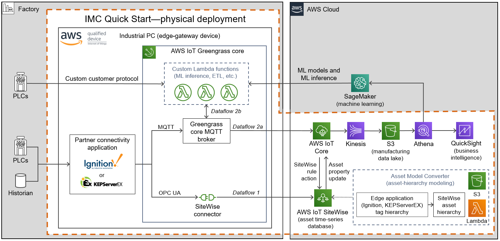

This Quick Start deploys resources based on the deployment type: virtual or physical. The resources deployed for each type are shown in the following two architecture diagrams, outlined in the dotted orange box.

Deploying the *virtual* option of the {partner-product-short-name} Quick Start with default parameters builds the following {partner-product-name} environment in the AWS Cloud.

//[#architecture1]
:xrefstyle: short
[#architecture-virtual]
.Quick Start architecture (virtual deployment) for {partner-product-name} on AWS
//[link=images/architecture_diagram.png]
//image::../images/architecture_diagram.png[Architecture,width=648,height=439]
image::../images/IMCQuickStartArchitecture-Virtual.png[Virtual architecture]

As shown in <<architecture-virtual>>, the virtual deployment of the {partner-product-short-name} Quick Start sets up the following resources:

//TODO Marcia to change these numbers to bullets and otherwise edit to match the diagram.

. *VPC:* The {partner-product-short-name} Quick Start can be launched in an existing default VPC or can generate a new VPC within which 2 EC2 instances are launched within a single availability zone and subnet.
. *AWS IoT Greengrass:* A Greengrass group is provisioned and deployed to the the edge gateway device (physical device or simulated with EC2 instance). This Greengrass group is configurable during cloudformation stack launch to include a SiteWise connector that will connect to the OPC UA server of the partner edge application (i.e. Ignition Server or KEPServerEX). The Greengrass core deployed to the edge device can be configured to route data through the SiteWise connector to AWS IoT SiteWise or via MQTT to AWS IoT Core's message broker.
. *AWS IoT Core:* AWS IoT Core can receive and route MQTT messages originating from both the partner edge software application (i.e. Ignition Server or KEPServerEX) or from the Greengrass core. These messages may contain the telemetry values of the PLC tags generated by the edge devices (PLCs). In the case that the Cirrus Link Driver for the AMC is configured, AWS IoT Core routes messages containing the asset hierarchy (metadata) for tags defined within Ignition Server running at the edge to the AMC where they are mapped into the appropriate resources within AWS IoT SiteWise.
. *AWS IoT SiteWise:* This service maintains the industrial machine asset hierarchy information and contains a managed time series database to store all data generted by these industrial assets. It also includes a SaaS dashboard building service called Monitor. Monitor allows users to build custom dashboards for near real-time data visualization. The AMC maps asset hiearchy data (i.e. Plant/Line/Machine/Tag) into SiteWise automatically as part of the Quick Start AWS CloudFormation stack launch.
. *Kinesis to S3:* Amazon Kinesis Data Firehose routes data messages from AWS IoT Core into an S3 bucket where they are stored and made available for analysis by services like Amazon QuickSight.
. *QuickSight:* Amazon QuickSight enables users to build custom business intelligence dashboards and visualizations for data that is routed to and stored in the S3 datalake. The {partner-product-short-name} Quick Start provides a simple data ingest route to S3 by default. Users can easily adapt and extend this basic framework to suit their individual needs.
. *Asset model converter (AMC):* The AMC is a serverless workflow that ingests asset hierarchy definition files/messages generated by the partner edge applications and converts them into a schema compatible with AWS IoT SiteWise's asset model definition schema. The AMC automatically generates asset models within sitewise, creates unique assets from those models and then links all assets together in a well-defined hierarchy that mirrors the industrial assets at the customer facility (i.e. factory/lines/machines/tags). The AMC was designed to enable additional partner edge applications to be integrated with it with minimal effort. The AMC architecture diagram is shown in more detail below. 

//TODO Shivansh, For this list, should we asterisk any of these elements and add this footnote? [.small]#*The template that deploys the Quick Start into an existing VPC skips the components marked by asterisks and prompts you for your existing VPC configuration.#

To deploy in a customer environment, you choose the *physical* {partner-product-short-name} Quick Start deployment, as shown in <<architecture-physical>>. The key difference from the virtual deployment type (<<architecture-virtual>>) is that the AWS IoT Greengrass Core is running on a physical industrial PC device at the customer's facility. 

[#architecture-physical]
.Quick Start architecture (physical deployment) for _{partner-product-name}_ on AWS
//[link=images/architecture_diagram.png]
//image::../images/architecture_diagram.png[Architecture,width=648,height=439]

As shown in <<architecture-physical>>, the physical deployment of the Quick Start deploys the same resources as the virtual deployment but with the following differences:

* There is no EC2 instances launched in a VPC in the AWS cloud. Instead, AWS IoT Greengrass is installed (via a bootstrap installation script that is provided as part of the CloudFormation stack launch) directly onto the industrial PC hardware running in the customer's facility.
* Edge applications (i.e. Ignition Serve, KEPServerEX, etc.) communicate with PLCs, historians, databases and IoT devices running in the customer facility.
* The user can choose to connect to either Ignition Server or KEPServerEX depending on what the customer user case requires.
* The rest of the resources remain the same as those in the virtual deployment type.

//TODO Shivansh, For this list, should we asterisk any of these elements and add this footnote? [.small]#*The template that deploys the Quick Start into an existing VPC skips the components marked by asterisks and prompts you for your existing VPC configuration.#

A key component of the {partner-product-short-name} Quick Start is the asset model converter (AMC). The AMC architecture is responsible for converting the asset hierarchy information defined within the edge application (Ignition Server, KEPServerEX, etc.) and provisioning the matching asset hierarchy in SiteWise. The AMC architecture, shown in <<amc-architecture>>, includes a sequence flow for the SiteWise resource provisioning.

[#amc-architecture]
.Asset model converter (AMC) architecture diagram
//[link=images/architecture_diagram.png]
//image::../images/architecture_diagram.png[Architecture,width=648,height=439]
image::../images/AMCArchitecture.png[AMC architecture]

The following table details the AMC sequence flow:

[cols="2,4a,8a"]
.AMC Sequence flow
|===
|*Step*
|*Activity*
|*Description*

|1(a)
|Upload path 1
|Automated AMC asset hierarchy ingest

|1(b)
|Upload path 2
|Manual AMC file definition upload to S3 upload

|2
|Ingest Lambda
|Ingest Lambda routes tag definition payloads into S3 bucket
Source: functions/source/AssetModelIngestion/assetModelIngestion.py

|3
|Object upload event
|Object upload event triggers Conversion/Provisioning lambda

|4
|Asset hierarchy conversion
|Convert input asset hierarchy definition to DynamoDB table items (conforming to SiteWise asset model and asset definition structure)

|5
|SiteWise resource provisioning
|Provision resources in SiteWise based on updated DynamoDB table items
Source: functions/source/AssetModelConverter/createSitewiseResources.py

|===

