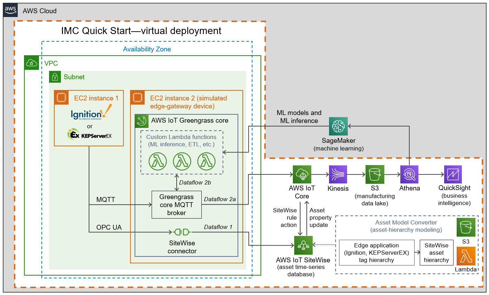

:xrefstyle: short

You deploy this Quick Start in either of two modes: 

* Virtual mode, for evaluation and training, as shown in <<architecture-virtual>>.
* Physical mode, for customer deployments, as shown in <<architecture-physical>>.

Deploying this Quick Start in virtual mode builds the following {partner-product-name} environment in the AWS Cloud. Elements of the Quick Start are outlined in the dotted orange box.

[#architecture-virtual]
.Architecture of the {partner-product-short-name} Quick Start - virtual deployment

As shown in <<architecture-virtual>>, the virtual deployment of the {partner-product-short-name} Quick Start sets up the following:

* A virtual private cloud (VPC) configured with a public subnet within a single Availability Zone. The {partner-product-short-name} Quick Start can be launched in an existing default VPC, or it can generate a new VPC. The template that deploys the Quick Start into an existing VPC prompts you for your existing VPC configuration.
* In the subnet:
** One Amazon Elastic Compute Cloud (Amazon EC2) instance for the partner edge application (such as Ignition or KEPServerEX).
** A second EC2 instance for the AWS IoT Greengrass core group. This instance simulates the edge gateway device. When you launch this Quick Start, you configure this group for the ingestion pattern, or edge-to-cloud path, that suits your use case: 
*** Path 1 sends data from the AWS IoT SiteWise connector running in an AWS IoT Greengrass core. This path goes from the open platform communications (OPC) unified architecture (UA) server of the partner edge application to AWS IoT SiteWise.
*** Path 2 sends data directly to AWS IoT Core from edge applications, such as Ignition with the Cirrus Link MQTT module. 
*** Path 3 sends data from the edge application (such as Ignition or KEPServerEX) to AWS IoT Greengrass. There, customer-defined AWS Lambda functions process or filter the data and use it for local machine-learning (ML) model inference through Amazon SageMaker. Or the data may be consumed by a containerized Docker application. Raw and processed data can then be transmitted to the AWS Cloud through a number of paths, including AWS IoT Core, Amazon Kinesis Data Streams, or AWS IoT Analytics. While these edge-processing capabilities are not part of the {partner-product-short-name} Quick Start, you can add those components as needed.
* Asset Model Converter (AMC). The AMC is a serverless, module-based framework that uses Amazon S3 and Lambda to map edge-based asset-modeling software conventions onto AWS IoT SiteWise. When you launch the Quick Start, the AMC automatically maps the asset-hierarchy data (such as factory, line, machine, tag) onto AWS IoT SiteWise models and assets. For details, see <<amc-architecture>>. 
* AWS IoT SiteWise. This service maintains the information on the asset hierarchy. It also contains a managed time-series database of all the data generated by the assets. It includes a SaaS dashboard-building service called Monitor. With Monitor, you can build custom dashboards for near-real-time data visualization. 
* AWS IoT Core. This service receives and routes MQTT messages originating either from the partner edge software application (such as Ignition or KEPServerEX) or from the AWS IoT Greengrass core. If the Cirrus Link driver for the AMC is configured, AWS IoT Core routes messages containing asset-hierarchy information.
* Amazon Kinesis Data Firehose. This service routes data messages from AWS IoT Core to an S3 bucket.
* Amazon S3. The manufacturing data is stored as an S3 data lake.
* Amazon Athena and Amazon QuickSight. You use these services to build custom business-intelligence dashboards and visualizations for data stored in the data lake.

//TODO Shivansh, The draft said that the virtual deployment could use either Ignition or KEPServerEX, so I showed both icons in the diagram. Correct?

//TODO Shivansh, I swapped in the KEPServerEX logo for the generic Kepware logo. Acceptable?

Deploying this Quick Start in physical mode (in a factory), builds an environment like the one shown in <<architecture-physical>>. Elements of the Quick Start are outlined in the dotted orange box.

[#architecture-physical]
.Architecture of the {partner-product-short-name} Quick Start - physical deployment
image::../images/IMCQuickStartArchitecture-Physical.png[Physical architecture]

Unlike the virtual deployment (<<architecture-virtual>>), the physical deployment (<<architecture-physical>>) has the AWS IoT Greengrass core running on an industrial PC in the customer's factory. The physical deployment uses the same resources as the virtual deployment with the following differences:

* In physical deployments, EC2 instances are launched in a VPC in the AWS Cloud. Instead, AWS IoT Greengrass is installed (by a bootstrap installation script that's part of the AWS CloudFormation stack launch) directly onto the industrial PC hardware.
* In physical deployments, edge applications (Ignition, KEPServerEX) communicate with PLCs, historians, databases, and other IoT devices running in the factory.  

//TODO Shivansh, I deleted this bullet: "In physical deployments, you can connect to either Ignition or KEPServerEX, depending on the customer's use case." Is that truly a difference? If so (if the virtual deployment does NOT give us this choice), I'll add this bullet back in here. I'll also delete the KEPServerEX logo from the virtual diagram (earlier) and delete the bullets mentioning it.

For a zoomed-in view of the Asset Model Converter (AMC) that's shown in the bottom-right corner of <<architecture-virtual>> and <<architecture-physical>>, see <<amc-architecture>>.

[#amc-architecture]
.Asset Model Converter (AMC) architecture diagram
image::../images/AMCArchitecture.png[AMC architecture]

The AMC, detailed in <<amc-architecture>>, is a serverless workflow that ingests asset-hierarchy-definition files or messages generated by the partner edge applications and converts them into a schema compatible with AWS IoT SiteWise. Based on the driver you select, the AMC ingests and converts the asset-hierarchy information defined in the edge application (such as Ignition or KEPServerEX) and automatically provisions a matching asset hierarchy in AWS IoT SiteWise. The AMC generates asset models within AWS IoT SiteWise, creates unique assets from those models, and then links all the assets together in a hierarchy that mirrors the industrial assets at the customer facility (such as factory, lines, machines, and tags). With this automatic mapping, application builders—whether they be the customer's own developers, regional or global systems integrators, or an AWS ProServe team—have immediate access to the customer's asset hierarchy within a managed service (AWS IoT SiteWise) in the AWS Cloud. 
 
The AMC integrates additional partner edge applications with minimal effort.  

The AMC architecture includes a sequence flow for provisioning the AWS IoT SiteWise resources, as described in the following table. The numbers used in this table correspond to the numbers shown in <<amc-architecture>>.

.AMC sequence flow
|===
|*Step* |*Activity* |*Description*

|1a (option a)
|Automated upload
|The asset hierarchy and tag definitions are automatically ingested.

|1b (option b)
|Manual upload
|The asset hierarchy and tag definitions are manually uploaded to Amazon S3.

|2 (only with 1a)
|Lambda ingestion
|The asset hierarchy and tag definitions are ingested into Lambda and then routed into an S3 bucket. Source: functions/source/AssetModelIngestion/assetModelIngestion.py

|3
|Object-upload event
|An object-upload event initiates Lambda conversion and provisioning.

|4
|Asset-hierarchy conversion
|The input hierarchy and definitions are converted to DynamoDB table items, conforming to the AWS IoT SiteWise asset model and asset-definition structure.

|5
|AWS IoT SiteWise resource provisioning
|Resources in AWS IoT SiteWise are provisioned based on updated DynamoDB table items. Source: functions/source/AssetModelConverter/createSitewiseResources.py
|===

